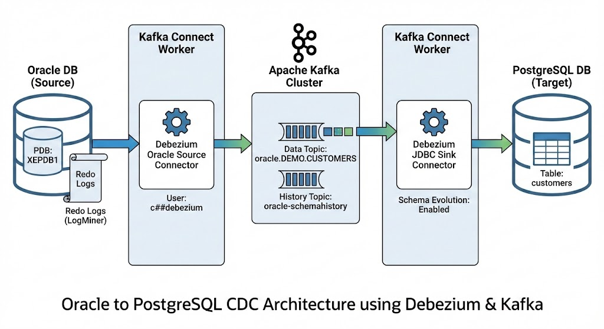

# Live streaming Oracle -> PostgreSQL

## Demo setup
As usual you can provision the environment by using: `./00-provision.sh`. 

This will create the following:



| Container | Port | Purpose | User | Password |
| --- | --- | --- | --- | --- |
| zookeeper | 2181 | | | |
| kafka | 9092 | | | |
| connect | 8083 | | | |
| oracle | 1521 | | oracle | password |
| | | | debezium | password |
| | | | demo | demo |
| postgres | 5432 | | postgres | password |

On Oracle a database called `demo` is created:
```
CREATE TABLE demo.customers (
  id NUMBER PRIMARY KEY,
  name VARCHAR2(100),
  created_at TIMESTAMP DEFAULT CURRENT_TIMESTAMP
);
```

After everything is provisioned, wait at least 30 seconds to Kafka to create the topic. You can check if the topic is created by running: `docker exec -it kafka /kafka/bin/kafka-console-consumer.sh --bootstrap-server kafka:9092 --topic oracle.DEMO.CUSTOMERS --from-beginning`.

If you get the following message, then the topic is not created yet. Patience.
```
[2025-12-17 12:58:11,664] WARN [Consumer clientId=console-consumer, groupId=console-consumer-40212] 
The metadata response from the cluster reported a recoverable issue with correlation id 2 : 
{oracle.DEMO.CUSTOMERS=LEADER_NOT_AVAILABLE} (org.apache.kafka.clients.NetworkClient)
```
When running the above command there should be no output unless a new record has been created in the Oracle `demo.customers` table.

## Demo flow
- Open two panes, one connecting to the Oracle container (`docker exec -it oracle sqlplus demo/demo@//localhost:1521/XEPDB1`),  one connecting to th Postgres container (`docker exec -it postgres psql -U postgres -d demo`).
- In the Postgres container, run `\dt` to see if the table is already created. Keep trying and when it is, run `SELECT * FROM customers;`. This may take a couple of tries.
- In the Oracle container, create a new record using `INSERT INTO customers VALUES (2, 'James', CURRENT_TIMESTAMP); COMMIT;`.
- In the Postgres container, run the same query again. Notice that the record being replicated.

## TODO
- Ability to create and replicate new tables.
